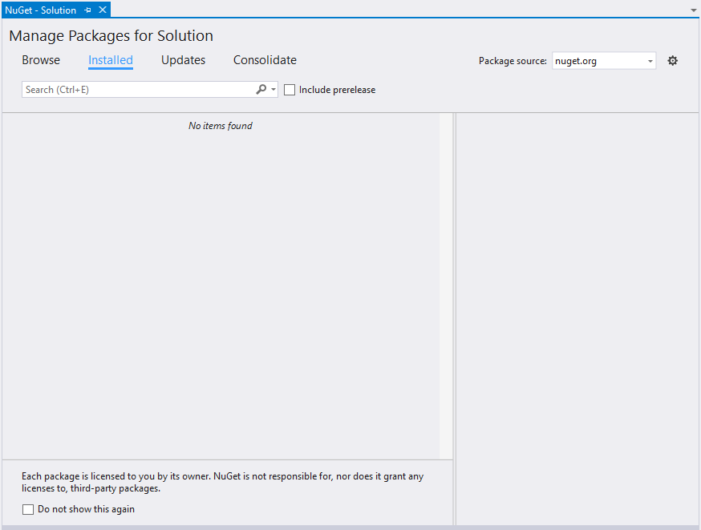
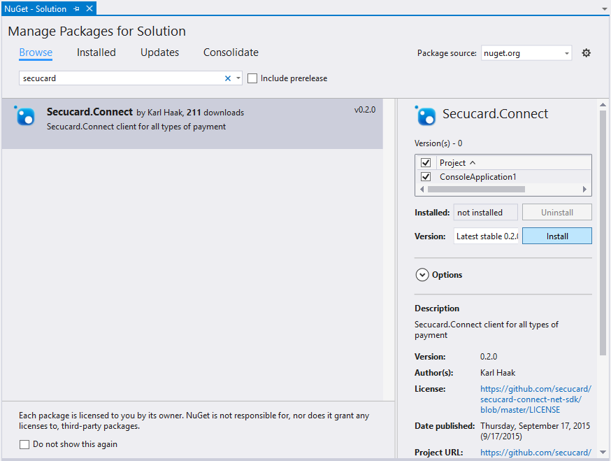
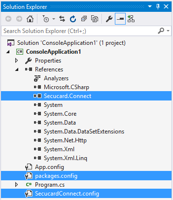
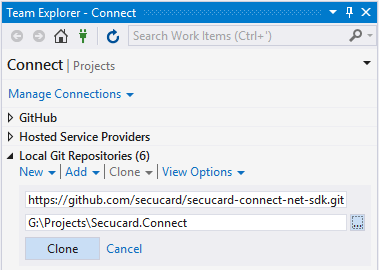
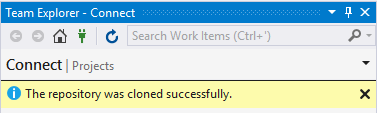
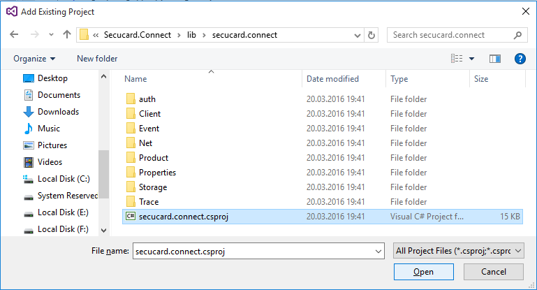
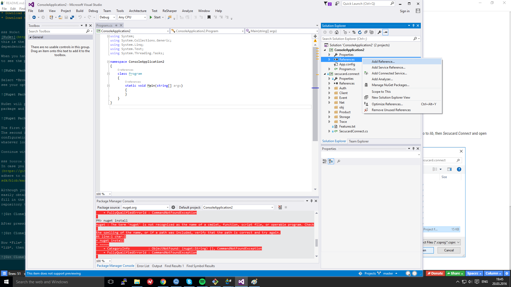
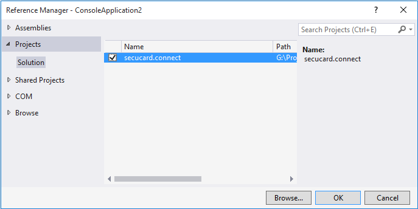

# .NET SDK Guide

SDK for using the [secuconnect API](http://developer.secuconnect.com) with .NET.

## Requirements

* .NET Framework 4.5
* C# .NET-supporting IDE, for example Microsoft Visual Studio or MonoDevelop

## Creating a new project
Whatever your install method is, you will reference the SDK from your own project, so we'll first need to create one. If you do not yet have Visual Studio installed, go ahead and [download and install](https://www.visualstudio.com/downloads/download-visual-studio-vs.aspx) one on your computer.

Start Visual Studio and select *File* -> *New* -> *Project*. For this example, we're going to create a [C# Console Application](https://msdn.microsoft.com/library/452fz12a.aspx). Select the *Console Application* template, type in a project name and press *OK*.

## Installing the SDK
You can use the SDK using one of the following methods:

* Install the [Secucard.Connect NuGet package](https://www.nuget.org/packages/Secucard.Connect/)
* Download or clone the [source code](https://github.com/secucard/secucard-connect-net-sdk)
* Download the [latest binary release](https://github.com/secucard/secucard-connect-net-sdk/releases)

### NuGet
[NuGet](https://www.nuget.org/) is a package manager for Microsoft development platforms, including .NET. For most users, this is the recommended method for using our SDK. NuGet automatically manages your project references and their dependencies, and lets you switch between release versions easily.

When you have created your solution, go to *Tools* -> *NuGet Package Manager* -> *Manage NuGet Packages for Solution...* to see the package manager:

Select *Browse* and type *secucard*. A list will show up, listing **Secucard.Connect**. When you select this package, you see your options on the right. You select the project in which you want to make use of the SDK and press *Install*:

NuGet will present the intended changes to your solution and ask you to confirm these changes. Press *OK* to install the package and add references and necessary files, which you'll see in the Solution Explorer:

The first item is a reference to the package which you just installed. All projects using the SDK need this reference. The second item is created by NuGet and is necessary for NuGet to function properly. The third and last item is a configuration file for the SDK. You can change the configuration settings as you see fit, and you can move the file to whatever location fits your project structure best.

Continue with [Using the SDK](using.md).

### Source code
In case you want more control over the SDK, it is recommended that you use the [source code distribution](https://github.com/secucard/secucard-connect-net-sdk) of the SDK. You are free to change the source code as long as you adhere to our licence, which you can find in the file [*LICENSE.md*](https://github.com/secucard/secucard-connect-net-sdk/blob/master/README.md) in the root folder of the source code distribution.

Although you can download the source code, unzip and use it, it is recommended that you clone our repository, so you can easily obtain updates. To do so, select *View* -> *Team Explorer* and unfold *Local Git Repositories*. Select *Clone* and fill in the following URL: https://github.com/secucard/secucard-connect-net-sdk.git and select a folder to clone the repository to.

After pressing *Clone*, Visual Studio confirms that the action succeeded.

Now select *File* -> *Add* -> *Existing Project...* and browse to the folder where you just cloned the repository to. Go to *lib*, then *Secucard.Connect* and open *Secucard.Connect.csproj*.

The newly added project will show up in your solution, but you still need to reference that project to your own in order to use it. Right-click your project's *References* item, then click *Add Reference...*.

Select *Projects* -> *Solution* and check the box left of *Secucard.Connect*. Now press *OK* to confirm the reference.

Continue with [Using the SDK](using.md).

### Source code

TBD