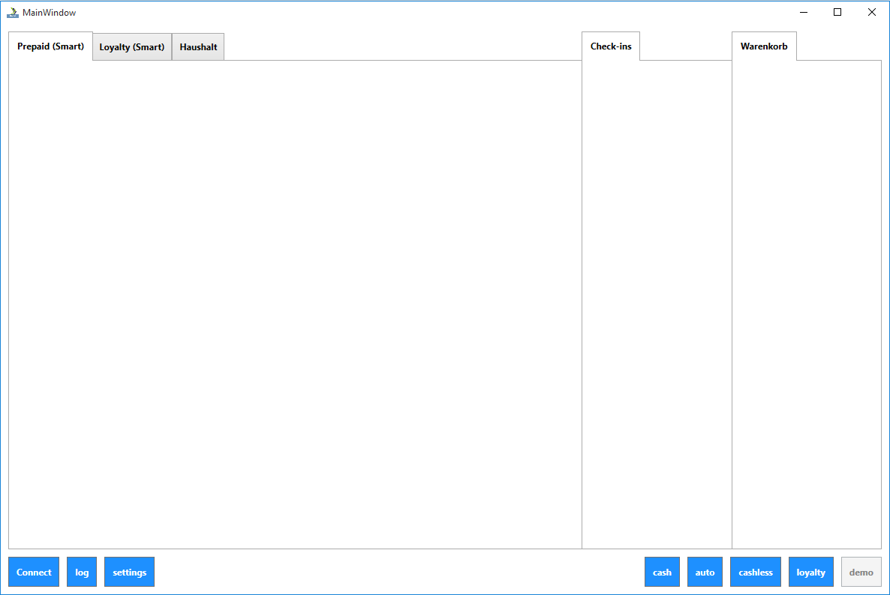

# .NET Sample applications

## Console Application

The Console Application is written in C# and is located in the *app* folder in the SDK.

To run this project, open the solution file *Secucard.Connect.sln*. Then right-click the project "Secucard.Connect.DemoApp" and select *Set as StartUp Project*. Now press the *Start* button to build and start the demo application.

## Cashier demo

The cashier demo is a WPF app written in C#.

### Links

* [Sourcecode on Github](https://github.com/secucard/secucard-net-cashier-app)

### Building

1. clone from repositoriy: `git clone https://github.com/secucard/secucard-net-cashier-app`
2. open the solution file CashierApp.sln
3. go to *Tools* -> *NuGet Package Manager* -> *Package Manager Console*
4. execute `Install-Package Secucard.Connect -Project Cashier`
5. press *Start* or the *F5* key on your keyboard

### Showcase

This app is a demostration how to integrate and use all available secuconnect features in a .NET cashier system.

### Screenhosts

